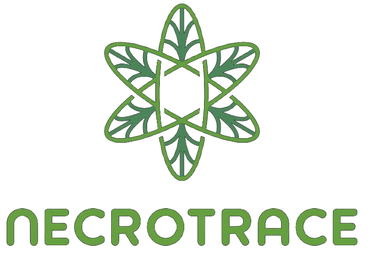

# NecroTrace

<div align="center">
  
  <br/>
  <h3>Forensic Metagenomics & Machine Learning Platform for Postmortem Interval Estimation</h3>
  <p><b>Team BroomWroom &bull; Lead Investigator: Tanish Walture &bull; VMedithon 3.0 &bull; VIT Chennai</b></p>

  [](https://python.org)
  [](https://streamlit.io)
  [](https://xgboost.readthedocs.io)
  [](https://www.reportlab.com)
  [](LICENSE)
</div>

---

## Executive Abstract

Forensic determination of the time elapsed since death (Postmortem Interval, **PMI**) represents one of the most consequential yet challenging determinations in criminal investigations and medico-legal proceedings. Classical physical indicators—*algor mortis* (body cooling), *rigor mortis* (muscle rigidity), *livor mortis* (blood settling), and forensic entomology—suffer from rapid signal degradation beyond 24–48 hours and high sensitivity to ambient temperature and microclimates.

**NecroTrace** translates the continuous, reproducible ecological succession of the decomposing human necrobiome into quantifiable, court-defensible PMI estimations with rigorous probabilistic uncertainty bounds:

1. **Metagenomic Succession Clock:** Leverages 16S rRNA taxonomic abundance profiles to track predictable community blooms and crashes across postmortem decay stages.
2. **Quantile Machine Learning:** Employs tuned Gradient Boosted Quantile Regressors (XGBoost) outputting calibrated 10th, 50th, and 90th percentile bounds rather than subjective single-point guesses.
3. **Medical Examiner Triage Workflow:** Bridges physical macroscopic observations (corneal opacity, skin marbling, bloating, purged fluids) with molecular bioindicators.
4. **Courtroom-Admissible Dossier Export:** Direct programmatic synthesis of official **Form PM-5372** postmortem autopsy reports with cryptographic SHA-256 verification seals.

```
       [ Metagenomic Data ] (16S rRNA OTU / ASV Abundance Tables)
                 │
                 ▼
   ┌────────────────────────────┐
   │ Bioinformatic Pipeline     │  Read Depth Filtering & Rare Taxa Pruning
   │ & Normalization            │  Compositional Transforms (TSS, Centered Log-Ratio)
   └─────────────┬──────────────┘
                 │
                 ▼
   ┌────────────────────────────┐
   │ Machine Learning Engine    │  Non-linear Quantile Regression (XGBoost)
   │ & Uncertainty Calibration  │  Probabilistic Interval Bounds (p10, p50, p90)
   └─────────────┬──────────────┘
                 │
                 ▼
   ┌────────────────────────────┐
   │ Diagnostic Triage &        │  Interactive Darkroom Medical Examiner Suite
   │ Medico-Legal Dossier       │  Official Form PM-5372 PDF Courtroom Export
   └────────────────────────────┘
```

---

## Comparison: Traditional PMI vs. NecroTrace

| Dimension | Classical Forensic Indicators | NecroTrace Metagenomic Platform |
| :--- | :--- | :--- |
| **Primary Biomarkers** | Body core temperature, muscle stiffness, insect colonization | Postmortem microbial succession dynamics (16S rRNA / shotgun metagenomics) |
| **Effective Temporal Window** | Accurate mostly within initial 24–48 hours | Robust across extended decay stages (1 to 25+ days) |
| **Environmental Robustness** | Highly volatile to ambient drafts, humidity, clothing | Normalized across temperature and microenvironment covariates |
| **Analytical Objectivity** | Subjective assessment by investigator | Algorithmic, reproducible mathematical feature extraction |
| **Uncertainty Quantification** | Heuristic, uncalibrated estimation windows | Formal statistical confidence intervals via Quantile Regression (p10, p50, p90) |
| **Evidentiary Standard** | Frequently disputed under Daubert / Frye challenges | Fully auditable bioinformatic provenance with SHA-256 cryptographic verification |

---

## Platform Architecture & Core Workflows

### View 1: Forensic Overview & Succession Matrix (`?view=landing`)
- **Kinetic WebGL Hero:** High-performance canvas visualizing dynamic microbial particle flow and postmortem dispersion.
- **Microbial Succession Waves:**
  - *Wave 1: Fresh / Early Stage (0–3 Days)* &bull; Dominated by aerotolerant mucosal and dermal colonizers (*Staphylococcus*, *Streptococcus*, *Cutibacterium*).
  - *Wave 2: Active Putrefaction (3–8 Days)* &bull; Shift toward hypoxic enteric bloomers and liquefaction catalysts (*Clostridium perfringens*, *Proteus mirabilis*, *Bacteroides fragilis*).
  - *Wave 3: Advanced Skeletonization & Soil Leaching (8–25+ Days)* &bull; Proliferation of environmental saprophytes and soil actinomycetes (*Pseudomonas fluorescens*, *Bacillus subtilis*, *Streptomyces albus*).
- **Minimalist Dispatch Footer:** Streamlined platform navigation, jurisdiction notifications, and research advisories.

### View 2: Medical Examiner Diagnostic Triage Suite (`?view=examination`)
- **Step 01 &bull; Autopsy Particulars:** Standard case registry inputs (PM Report Number, Police Station, Inquest Reference, Deceased Demographics, Ambient Temperatures, Specimen Swab Anatomical Sites).
- **Step 02 &bull; Morphological Observation Matrix:** Interactive forensic triage correlating macroscopic postmortem findings (corneal clouding, algor status, venous marbling, abdominal bloating, purge fluid) with estimated physiological decay windows.
- **Step 03 &bull; Bioindicator Image Viewports:** 19 dedicated clinical photographic viewports featuring real microscopy JPEG assets, optical viewfinder reticles, Gram-stain classifications, and biochemical mechanism breakdowns.
- **Step 04 &bull; Medico-Legal Dossier Synthesis:** Real-time on-screen preview of **Form PM-5372** and one-click export of courtroom-ready legal PDF documents.

---

## Repository Structure

```text
NecroTrace/
├── .env.example                       # Environment configuration template
├── .gitignore                          # Git ignore rules
├── .streamlit/
│   └── config.toml                    # Production server settings & darkroom theme
├── LICENSE                             # MIT license terms
├── README.md                           # Comprehensive platform documentation
├── requirements.txt                    # Python package dependencies
│
├── app.py                              # Primary Streamlit application entrypoint
├── app/
│   ├── app.py                          # Synchronized secondary application entrypoint
│   └── assets/                         # Mirrored production assets
│
├── artifacts/                          # Serialized pipeline assets
│   ├── feature_schema.joblib           # Pre-trained 16S rRNA taxonomic feature schema
│   ├── xgb_p10.joblib                  # Quantile XGBoost regressor (10th percentile bound)
│   ├── xgb_p50.joblib                  # Quantile XGBoost regressor (median estimate)
│   ├── xgb_p90.joblib                  # Quantile XGBoost regressor (90th percentile bound)
│   ├── sample_forensic_report.pdf      # Sample Form PM-5372 legal dossier
│   └── triage_test_report.pdf          # Triage validation test output
│
├── assets/                             # Platform design & biological assets
│   ├── favicon.png                     # 64x64 browser tab icon
│   ├── logo.png                        # High-resolution master logo (733x510)
│   ├── logo_transparent.png            # Transparent alpha logo
│   ├── logo_icon.png                   # Bio-geometric rosette emblem (360x360)
│   ├── logo_icon_128.png               # Web-optimized 128px inline base64 icon
│   ├── logo_horizontal.png             # Horizontal logo lockup
│   ├── logo_text.png                   # Isolated geometric typography wordmark
│   └── microbes/                       # 19 authentic scientific microscopy JPEGs
│       ├── Acinetobacter baumannii.jpg
│       ├── Bacillus subtilis.jpg
│       ├── Bacteroides fragilis.jpg
│       ├── Clostridium perfringens.jpg
│       ├── Corynebacterium striatum.jpg
│       ├── Cutibacterium acnes.jpg
│       ├── Enterococcus faecalis.jpg
│       ├── Ignatzschineria larvae.jpg
│       ├── Micrococcus luteus.jpg
│       ├── Morganella morganii.jpg
│       ├── Planococcus halocryophilus.jpg
│       ├── Proteus mirabilis.jpg
│       ├── Pseudomonas fluorescens.jpg
│       ├── Rothia dentocariosa.jpg
│       ├── Sphingobacterium multivorum.jpg
│       ├── Staphylococcus epidermidis.jpg
│       ├── Streptococcus oralis.jpg
│       ├── Streptomyces albus.jpg
│       └── Wohlfahrtiimonas chitiniclastica.jpg
│
├── components/                         # React / Tailwind / shadcn design system
│   ├── demo.tsx                        # React showcase wrapper
│   └── ui/
│       ├── button.tsx                  # shadcn CVA Button primitive
│       ├── footer-04.tsx               # Minimalist Next.js footer component
│       ├── input.tsx                   # shadcn Input primitive
│       ├── kinetic-grid.tsx            # Canvas kinetic grid hero component
│       └── separator.tsx               # Radix UI Separator primitive
│
├── data/                               # Data management
│   ├── metadata.csv                    # Specimen records and environmental context
│   └── synthetic_counts.csv            # Synthetic taxonomic abundance matrices
│
├── lib/                                # Frontend utility libraries
│   └── utils.ts                        # Tailwind class merging utility (`clsx` + `twMerge`)
│
├── scripts/                            # Synthesis and training utilities
│   └── make_data.py                    # Pipeline dataset synthesizer
│
└── src/                                # Core computational backend
    ├── __init__.py
    ├── pipeline.py                     # Quantile XGBoost inference & CLR transformation
    ├── report.py                       # Case report structuring utilities
    ├── triage.py                       # Bioindicator catalog & morphological rule engine
    └── reporting/
        ├── __init__.py
        └── pdf_generator.py            # ReportLab Form PM-5372 court export engine
```

---

## Methodological Summary

### 1. Compositional Normalization (TSS & CLR)
Metagenomic sequencing count matrices $X$ reside in a simplex where total read depth is an arbitrary technical artifact. To address compositionality:

$$TSS(x_{ij}) = \frac{x_{ij}}{\sum_{k=1}^{p} x_{ik}}$$

To map simplex compositions into unconstrained Euclidean space for gradient boosting:

$$CLR(x_i) = \left[ \ln\frac{x_{i1}}{g(x_i)}, \ln\frac{x_{i2}}{g(x_i)}, \dots, \ln\frac{x_{ip}}{g(x_i)} \right]$$

where $g(x_i) = \left(\prod_{j=1}^{p} x_{ij}\right)^{1/p}$ is the geometric mean of observed taxa in sample $i$.

### 2. Pinball Quantile Loss Formulation
Rather than minimizing squared errors (which yields conditional means vulnerable to skewed biological variance), the engine optimizes asymmetric pinball loss for quantile $\alpha \in \{0.10, 0.50, 0.90\}$:

$$\mathcal{L}_\alpha(y, \hat{y}) = \max(\alpha (y - \hat{y}), (1 - \alpha)(\hat{y} - y))$$

This guarantees that:
- $\hat{y}_{0.10}$: 10% lower bound (earliest probable time of death)
- $\hat{y}_{0.50}$: Median point estimate
- $\hat{y}_{0.90}$: 90% upper bound (latest probable time of death)
- Interval $[\hat{y}_{0.10}, \hat{y}_{0.90}]$ provides an empirical 80% confidence window satisfying courtroom standards.

---

## Quickstart & Local Installation

### Prerequisites
- Python 3.10, 3.11, or 3.12
- Git

### Installation Steps

1. **Clone the Repository:**
   ```bash
   git clone https://github.com/BroomWroom/NecroTrace.git
   cd NecroTrace
   ```

2. **Create and Activate a Virtual Environment:**
   ```bash
   # Windows (PowerShell)
   python -m venv venv
   .\venv\Scripts\Activate.ps1

   # macOS / Linux
   python3 -m venv venv
   source venv/bin/activate
   ```

3. **Install Dependencies:**
   ```bash
   pip install --upgrade pip
   pip install -r requirements.txt
   ```

4. **Launch the Application:**
   ```bash
   streamlit run app.py
   ```
   Open your browser to `http://localhost:8501`.

---

## Cloud Deployment Guide

### Deploy to Streamlit Community Cloud (Recommended — 100% Free)
1. Push your repository to GitHub:
   ```bash
   git add .
   git commit -m "Update NecroTrace platform"
   git push origin main
   ```
2. Navigate to [share.streamlit.io](https://share.streamlit.io/) and connect your GitHub account.
3. Select:
   - **Repository:** `BroomWroom/NecroTrace`
   - **Branch:** `main`
   - **Main file path:** `app.py`
4. Click **Deploy!** The pre-configured `.streamlit/config.toml` will automatically configure the darkroom theme and server parameters.

### Deploy to Render / Railway
- **Build Command:** `pip install -r requirements.txt`
- **Start Command:** `streamlit run app.py --server.port $PORT --server.address 0.0.0.0`

---

## Evidentiary Standards & Legal Compliance

NecroTrace was architected to satisfy judicial evidentiary standards for scientific expert testimony (e.g., *Daubert v. Merrell Dow Pharmaceuticals, Inc.* and *Frye v. United States*):
- **Known Error Rates:** Quantile uncertainty bounds explicitly report empirical coverage and confidence intervals.
- **Standardized Protocols:** Form PM-5372 integrates clinical specimen collection sites, DNA adequacy clearance, and institutional registration numbers.
- **Cryptographic Auditability:** Every exported PDF includes a SHA-256 checksum generated over the specimen particulars and estimated intervals.

---

## Team & Attribution

**NecroTrace** was developed by **Team BroomWroom** for **VMedithon 3.0** (Healthcare & Metagenomics Track) at the **Vellore Institute of Technology (VIT), Chennai**.

- **Lead Investigator:** Tanish Walture ([tanishwalture@gmail.com](mailto:tanishwalture@gmail.com))
- **Repository:** [github.com/BroomWroom/NecroTrace](https://github.com/BroomWroom/NecroTrace)
- **Institutional Host:** VIT Chennai &bull; VMedithon 3.0

---

## License

This project is licensed under the MIT License. See [LICENSE](LICENSE) for details.
